# Diagramas de la Arquitectura del Modelo de Sokoban

Este documento recopila las representaciones de las clases que pertenecen estrictamente a la carpeta `model` (incluyendo los subpaquetes escenario, reglas, historial, persistencia y factory).

## 1. Diagrama de Clases en Mermaid

```mermaid
classDiagram
    class JuegoSokoban {
        -List~Nivel~ nivelesDisponibles
        -Nivel nivelActual
        -Tablero tableroActual
        -HistorialMovimientos historial
        -ManejadorColision cadenaColisiones
        -GestorPersistencia persistencia
        +JuegoSokoban(List~Nivel~ nivelesDisponibles)
        +seleccionarNivel(Nivel nivel) void
        +deshacerUltimaAccion() void
        +reiniciarNivelActual() void
        +agregarNivel(Nivel n) void
        +getCadenaColisiones() ManejadorColision
        +capturarEstadoActual() PartidaMomento
        +verificarYRegistrarVictoria() void
    }

    class Tablero {
        -int filas
        -int columnas
        -Casilla[][] celdas
        -Personaje personaje
        +Tablero(int filas, int columnas)
        +getFilas() int
        +getColumnas() int
        +obtenerCasilla(int f, int c) Casilla
        +actualizarCasilla(int f, int c, Casilla nuevaCasilla) void
        +esTransitable(int f, int c) bool
        +getPersonaje() Personaje
    }

    class Casilla {
        <<abstract>>
        -int fila
        -int columna
        +getFila() int
        +setFila(int fila) void
        +getColumna() int
        +setColumna(int columna) void
        +esTransitable()* bool
    }

    class Personaje {
        +Personaje(int fila, int columna)
        +mover(Direccion d, Tablero t) bool
        +mover(Direccion d, Tablero t, ManejadorColision cadenaColisiones) bool
        +esTransitable() bool
    }

    class Caja {
        -bool enMeta
        +Caja(int fila, int columna)
        +Caja(int fila, int columna, bool enMeta)
        +mover(Direccion d, Tablero t) bool
        +isEnMeta() bool
        +setEnMeta(bool enMeta) void
        +esTransitable() bool
    }

    class Pared {
        +Pared(int f, int c)
        +esTransitable() bool
    }

    class Meta {
        +Meta(int f, int c)
        +esTransitable() bool
    }

    class SueloComun {
        +SueloComun(int f, int c)
        +esTransitable() bool
    }

    class FabricaNiveles {
        +construirTablero(Nivel n) Tablero
    }

    class HistorialMovimientos {
        -int movimientosContador
        -Deque~PartidaMomento~ historial
        +registrarEstado(PartidaMomento e) void
        +extraerUltimoEstado() PartidaMomento
        +vaciarHistorial() void
        +getMovimientosContador() int
    }

    class Nivel {
        -bool completado
        -String[][] mapaDatos
        +Nivel(String[][] mapaDatos)
        +Nivel(String[][] mapaDatos, bool completado)
        +isCompletado() bool
        +setCompletado(bool completado) void
        +getMapaDatos() String[][]
        +marcarComoCompletado() void
    }

    class PartidaMomento {
        -Map~Caja, Casilla~ posicionesCajas
        -Casilla posicionJugador
        +PartidaMomento(Map~Caja, Casilla~ posicionesCajas, Casilla posicionJugador)
        +restaurarEnTablero(Tablero t) void
    }

    class GestorPersistencia {
        -String archivoRuta
        +GestorPersistencia(String archivoRuta)
        +guardarProgreso(List~Nivel~ niveles) void
        +cargarProgreso() List~Integer~
        +cargarNivelDesdeRecursos(int nivelId) Nivel
    }

    class ManejadorColision {
        <<interface>>
        +setSiguiente(ManejadorColision siguiente) void
        +procesarMovimiento(Tablero tablero, Casilla origen, Direccion dir) bool
    }

    class ManejadorPared {
        -ManejadorColision siguiente
        +setSiguiente(ManejadorColision siguiente) void
        +procesarMovimiento(Tablero tablero, Casilla origen, Direccion dir) bool
    }

    class ManejadorCaja {
        -ManejadorColision siguiente
        +setSiguiente(ManejadorColision siguiente) void
        +procesarMovimiento(Tablero tablero, Casilla origen, Direccion dir) bool
    }

    class ManejadorMovimientoBase {
        -ManejadorColision siguiente
        +setSiguiente(ManejadorColision siguiente) void
        +procesarMovimiento(Tablero tablero, Casilla origen, Direccion dir) bool
    }

    ManejadorColision <|.. ManejadorPared : implements
    ManejadorColision <|.. ManejadorCaja : implements
    ManejadorColision <|.. ManejadorMovimientoBase : implements
    ManejadorColision --> ManejadorColision : siguiente

    Casilla <|-- Personaje : extends
    Casilla <|-- Caja : extends
    Casilla <|-- Pared : extends
    Casilla <|-- Meta : extends
    Casilla <|-- SueloComun : extends

    Tablero *--> Casilla : celdas
    Tablero --> Personaje : personaje
    JuegoSokoban --> Tablero : tableroActual
    JuegoSokoban --> ManejadorColision : cadenaColisiones
    JuegoSokoban --> HistorialMovimientos : historial
    JuegoSokoban --> GestorPersistencia : persistencia
    JuegoSokoban --> Nivel : nivelActual
    HistorialMovimientos o--> PartidaMomento : historial
```

---

## 2. Diagrama de Clases en PlantUML

```plantuml
@startuml
skinparam classAttributeIconSize 0

' Model Core
class JuegoSokoban {
    - nivelesDisponibles: List<Nivel>
    - nivelActual: Nivel
    - tableroActual: Tablero
    - historial: HistorialMovimientos
    - cadenaColisiones: ManejadorColision
    - persistencia: GestorPersistencia
    + JuegoSokoban(nivelesDisponibles: List<Nivel>)
    + seleccionarNivel(nivel: Nivel): void
    + procesarEntrada(dir: Direccion): void
    + deshacerUltimaAccion(): void
    + reiniciarNivelActual(): void
    + agregarNivel(n: Nivel): void
    - buscarOperario(): Casilla
    - capturarEstadoActual(): PartidaMomento
    - verificarYRegistrarVictoria(): void
}

class Tablero {
    - filas: int
    - columnas: int
    - celdas: Casilla[][]
    + Tablero(filas: int, columnas: int)
    + getFilas(): int
    + getColumnas(): int
    + obtenerCasilla(f: int, c: int): Casilla
    + actualizarCasilla(f: int, c: int, nuevaCasilla: Casilla): void
    + moverOperario(d: Direccion): boolean
    + esTransitable(f: int, c: int): boolean
    - buscarPersonaje(): Personaje
    - sincronizarCoordenadas(): void
}

abstract class Casilla {
    - fila: int
    - columna: int
    + getFila(): int
    + setFila(fila: int): void
    + getColumna(): int
    + setColumna(columna: int): void
    + {abstract} esTransitable(): boolean
}

class Personaje extends Casilla {
    - enMeta: boolean
    + Personaje(fila: int, columna: int)
    + isEnMeta(): boolean
    + setEnMeta(enMeta: boolean): void
    + esTransitable(): boolean
}

class Caja extends Casilla {
    - enMeta: boolean
    + Caja(fila: int, columna: int)
    + Caja(fila: int, columna: int, enMeta: boolean)
    + isEnMeta(): boolean
    + setEnMeta(enMeta: boolean): void
    + esTransitable(): boolean
}

class Pared extends Casilla {
    + Pared(f: int, c: int)
    + esTransitable(): boolean
}

class Meta extends Casilla {
    + Meta(f: int, c: int)
    + esTransitable(): boolean
}

class SueloComun extends Casilla {
    + SueloComun(f: int, c: int)
    + esTransitable(): boolean
}

class FabricaNiveles {
    + construirTablero(n: Nivel): Tablero
    - crearCasilla(simbolo: String, fila: int, columna: int): Casilla
}

class HistorialMovimientos {
    - movimientosContador: int
    - historial: Deque<PartidaMomento>
    + registrarEstado(e: PartidaMomento): void
    + extraerUltimoEstado(): PartidaMomento
    + vaciarHistorial(): void
    + getMovimientosContador(): int
}

class Nivel {
    - completado: boolean
    - mapaDatos: String[][]
    + Nivel(mapaDatos: String[][])
    + Nivel(mapaDatos: String[][], completado: boolean)
    + isCompletado(): boolean
    + setCompletado(completado: boolean): void
    + getMapaDatos(): String[][]
    + marcarComoCompletado(): void
}

class PartidaMomento {
    - posicionesCajas: Map<Caja, Casilla>
    - posicionJugador: Casilla
    + PartidaMomento(posicionesCajas: Map<Caja, Casilla>, posicionJugador: Casilla)
    + restaurarEnTablero(t: Tablero): void
    - copiarPosicionesCajas(origen: Map<Caja, Casilla>): Map<Caja, Casilla>
    - copiarMatrizBase(tablero: Tablero): Casilla[][]
    - copiarComoTerrenoBase(casilla: Casilla, fila: int, columna: int): Casilla
    - copiarCaja(caja: Caja): Caja
    - copiarCajaEnPosicion(caja: Caja, posicion: Casilla): Caja
    - copiarCasilla(casilla: Casilla): Casilla
}

class GestorPersistencia {
    - archivoRuta: String
    + GestorPersistencia(archivoRuta: String)
    + guardarProgreso(niveles: List<Nivel>): void
    + cargarProgreso(): List<Integer>
    + cargarNivelDesdeRecursos(nivelId: int): Nivel
}

' Collision chain
interface ManejadorColision {
    + setSiguiente(siguiente: ManejadorColision): void
    + procesarMovimiento(tablero: Tablero, origen: Casilla, dir: Direccion): boolean
}

class ManejadorPared implements ManejadorColision {
    - siguiente: ManejadorColision
    + setSiguiente(siguiente: ManejadorColision): void
    + procesarMovimiento(tablero: Tablero, origen: Casilla, dir: Direccion): boolean
}

class ManejadorCaja implements ManejadorColision {
    - siguiente: ManejadorColision
    + setSiguiente(siguiente: ManejadorColision): void
    + procesarMovimiento(tablero: Tablero, origen: Casilla, dir: Direccion): boolean
}

class ManejadorMovimientoBase implements ManejadorColision {
    - siguiente: ManejadorColision
    + setSiguiente(siguiente: ManejadorColision): void
    + procesarMovimiento(tablero: Tablero, origen: Casilla, dir: Direccion): boolean
}

' Relations
JuegoSokoban *--> Tablero : tableroActual
JuegoSokoban *--> HistorialMovimientos : historial
JuegoSokoban *--> GestorPersistencia : persistencia
JuegoSokoban --> ManejadorColision : cadenaColisiones
JuegoSokoban --> Nivel : nivelActual

Tablero *--> Casilla : contiene matriz
HistorialMovimientos o--> PartidaMomento : almacena
ManejadorColision --> ManejadorColision : siguiente

@enduml
```

