# Diagrama de Clases - Carpeta `model` (Refactorizado con Visitor)

Este documento contiene el diagrama de clases Mermaid actualizado que representa la arquitectura física y lógica de la carpeta `model` del proyecto Sokoban.

Se han incorporado:
1. **Interfaces directas**: `Suelo`, `Meta` y `Tablero` implementan directamente `Transitable`, mientras que `Caja` implementa directamente `Empujable`.

```mermaid
classDiagram
    class JuegoSokoban {
        -List nivelesDisponibles
        -Nivel nivelActual
        -Tablero tableroActual
        -HistorialMovimientos historial
        -ReglasJuego reglasJuego
        -GestorPersistencia persistencia
        +JuegoSokoban(List nivelesDisponibles)
        +seleccionarNivel(Nivel nivel) void
        +deshacerUltimaAccion() void
        +reiniciarNivelActual() void
        +agregarNivel(Nivel n) void
        +getReglasJuego() ReglasJuego
        +getPersistencia() GestorPersistencia
        +capturarEstadoActual() PartidaMomento
    }

    class Tablero {
        -int filas
        -int columnas
        -CasillaMatrix celdas
        -booleanMatrix metas
        -Personaje personaje
        +Tablero(CasillaMatrix celdas, booleanMatrix metas, Personaje personaje)
        +getFilas() int
        +getColumnas() int
        +esMeta(int f, int c) bool
        +obtenerCasilla(int f, int c) Casilla
        +actualizarCasilla(int f, int c, Casilla nuevaCasilla) void
        +esTransitable(int f, int c) bool
        +getPersonaje() Personaje
    }

    class CargadorTablero {
        +cargar(CasillaMatrix celdas, booleanMatrix metas)$ Tablero
    }

    class Casilla {
        <<abstract>>
        -int fila
        -int columna
        +getFila() int
        +setFila(int fila) void
        +getColumna() int
        +setColumna(int columna) void
        +dibujar(Dibujador dibujador, T contenedor, int tamCelda)* void
    }

    class Transitable {
        <<interface>>
        +esTransitable() bool
    }

    class Empujable {
        <<interface>>
        +esEmpujable() bool
    }

    class Dibujador {
        <<interface>>
        +dibujarPared(Pared pared, T contenedor, int tamCelda) void
        +dibujarCaja(Caja caja, T contenedor, int tamCelda) void
        +dibujarPersonaje(Personaje personaje, T contenedor, int tamCelda) void
        +dibujarMeta(Meta meta, T contenedor, int tamCelda) void
        +dibujarSuelo(Suelo suelo, T contenedor, int tamCelda) void
    }

    class Personaje {
        +Personaje(int fila, int columna)
        +mover(Direccion d, Tablero t) bool
        +mover(Direccion d, Tablero t, GestorColisiones gestor) bool
    }

    class Caja {
        -bool enMeta
        +Caja(int fila, int columna)
        +Caja(int fila, int columna, boolean enMeta)
        +mover(Direccion d, Tablero t) bool
        +isEnMeta() bool
        +setEnMeta(boolean enMeta) void
    }

    class Pared {
        +Pared(int f, int c)
    }

    class Meta {
        +Meta(int f, int c)
    }

    class Suelo {
        +Suelo(int f, int c)
    }

    class FabricaNiveles {
        +construirTablero(Nivel n) Tablero
    }

    class HistorialMovimientos {
        -int movimientosContador
        -Deque historial
        +registrarEstado(PartidaMomento e) void
        +extraerUltimoEstado() PartidaMomento
        +vaciarHistorial() void
        +getMovimientosContador() int
    }

    class Nivel {
        -bool completado
        -StringMatrix mapaDatos
        +Nivel(StringMatrix mapaDatos)
        +Nivel(StringMatrix mapaDatos, bool completado)
        +isCompletado() bool
        +setCompletado(bool completado) void
        +getMapaDatos() StringMatrix
        +marcarComoCompletado() void
    }

    class PartidaMomento {
        -Map posicionesCajas
        -Casilla posicionJugador
        +PartidaMomento(Map posicionesCajas, Casilla posicionJugador)
        +restaurarEnTablero(Tablero t) void
    }

    class GestorPersistencia {
        -String archivoRuta
        +GestorPersistencia(String archivoRuta)
        +guardarProgreso(List niveles) void
        +cargarProgreso() List
        +cargarNivelDesdeRecursos(int nivelId) Nivel
    }

    class GestorColisiones {
        +procesarMovimiento(Tablero tablero, Personaje personaje, Direccion dir) bool
    }

    class ReglasJuego {
        -GestorColisiones gestorColisiones
        +ReglasJuego()
        +getGestorColisiones() GestorColisiones
        +verificarYRegistrarVictoria(Nivel nivelActual, Tablero tableroActual, List nivelesDisponibles, GestorPersistencia persistencia) void
    }

    class PanelTablero {
        +dibujarPared(Pared pared, StackPane contenedor, int tamCelda) void
        +dibujarCaja(Caja caja, StackPane contenedor, int tamCelda) void
        +dibujarPersonaje(Personaje personaje, StackPane contenedor, int tamCelda) void
        +dibujarMeta(Meta meta, StackPane contenedor, int tamCelda) void
        +dibujarSuelo(Suelo suelo, StackPane contenedor, int tamCelda) void
    }

    class ControladorTeclado {
        -Personaje personaje
        -Tablero tablero
        -GestorColisiones gestorColisiones
        -VentanaPrincipal ventanaPrincipal
        -Runnable antesDeMover
        -Runnable despuesDeMover
        -Runnable accionDeshacer
        -BooleanSupplier checkNivelCompletado
        +ControladorTeclado(Personaje personaje, Tablero tablero, GestorColisiones gestor)
        +setPersonaje(Personaje personaje) void
        +setTablero(Tablero tablero) void
        +setVentanaPrincipal(VentanaPrincipal vp) void
        +setAntesDeMover(Runnable antesDeMover) void
        +setDespuesDeMover(Runnable despuesDeMover) void
        +setAccionDeshacer(Runnable accionDeshacer) void
        +setCheckNivelCompletado(BooleanSupplier check) void
        +handle(KeyEvent evento) void
    }

    Casilla <|-- Personaje : extends
    Casilla <|-- Caja : extends
    Casilla <|-- Pared : extends
    Casilla <|-- Meta : extends
    Casilla <|-- Suelo : extends
    Casilla <|-- Tablero : extends

    Transitable <|.. Suelo : implements
    Transitable <|.. Meta : implements
    Transitable <|.. Tablero : implements
    Empujable <|.. Caja : implements

    Tablero *--> Casilla : celdas
    Tablero --> Personaje : personaje
    JuegoSokoban --> Tablero : tableroActual
    JuegoSokoban --> ReglasJuego : reglasJuego
    JuegoSokoban --> HistorialMovimientos : historial
    JuegoSokoban --> GestorPersistencia : persistencia
    JuegoSokoban --> Nivel : nivelActual
    ReglasJuego --> GestorColisiones : gestorColisiones
    HistorialMovimientos o--> PartidaMomento : historial
    ControladorTeclado --> Personaje : personaje
    ControladorTeclado --> Tablero : tablero
    ControladorTeclado --> GestorColisiones : gestorColisiones
    FabricaNiveles ..> CargadorTablero : uses
    CargadorTablero ..> Tablero : creates
    PanelTablero ..|> Dibujador : implements
```

2. **Patrón Visitor (`Dibujador<T>`)**: Las casillas delegan la renderización a un objeto gráfico genérico. Esto independiza por completo el Modelo (lógica de negocio) de la vista (JavaFX).

